# 🧪 Spring MVC vs Spring MVC Java 21 vs Spring WebFlux Benchmark Report

## 1️⃣ Overview

**Purpose:**  
This experiment evaluates and compares the performance of **Spring MVC (Tomcat)** and **Spring MVC Java 21 (Tomcat)**  and **Spring WebFlux (Netty)** applications under varying concurrent loads.  
The test focuses on throughput, latency, and system behavior when directly exposed (without API Gateway).

---

## 2️⃣ Application Logic

| Component              | Description                                                                                                                                             |
|------------------------|---------------------------------------------------------------------------------------------------------------------------------------------------------|
| **Spring MVC App**     | A blocking REST API built with Spring Boot + Tomcat. Exposes `/api/users/{id}` endpoint fetching user data from PostgreSQL using Spring Data JPA.       |
| **Spring MVC Java 21** | Same as above but leverage Java 21 Virtual Thread.                                                                                                      |
| **Spring WebFlux App** | A reactive REST API built with Spring Boot WebFlux + Netty. Uses R2DBC for non-blocking PostgreSQL access. Exposes the same `/api/users/{id}` endpoint. |
| **Database**           | PostgreSQL 15 with seeded test data (~10k user rows). Both applications connect to the same database for consistency.                                   |

---

## 3️⃣ System Architecture

```
               ┌────────────────────────┐
               │      Load Tester       │
               │       (  k6  )         │
               └──────────┬─────────────┘
                          │
               ┌──────────▼───────────┐
               │     Application      │
               │──────────────────────│
               │  Spring MVC (Tomcat) │
               │          OR          │
               │  WebFlux (Netty)     │
               └──────────┬───────────┘
                          │
               ┌──────────▼───────────┐
               │     PostgreSQL DB    │
               │ (R2DBC or JDBC conn) │
               └──────────────────────┘
```

**Request Flow:**
1. Load tester sends concurrent GET requests to `/api/users/{id}`.  
2. The application receives and processes the request:
   - **Spring MVC:** creates a new thread per request (Tomcat worker model).  
   - **WebFlux:** processes asynchronously using event loops (Netty model).  
3. Each app queries **PostgreSQL**, maps data from Entity → DTO, and returns JSON.  
4. Prometheus collects system metrics during the run.

---

## 4️⃣ Docker Setup

| Container                  | Description | Resources |
|----------------------------|--------------|------------|
| **PostgreSQL**             | Holds user data | `CPU: 3 cores`, `Memory: 4GB` |
| **Spring MVC App**         | Blocking Tomcat app | `CPU: 2 cores`, `Memory: 2GB` |
| **Spring MVC App Java 21** | Blocking Tomcat app | `CPU: 2 cores`, `Memory: 2GB` |
| **Spring WebFlux App**     | Reactive Netty app | `CPU: 2 cores`, `Memory: 2GB` |
| **Prometheus + Grafana**   | Metrics collection & visualization | `CPU: 1 core`, `Memory: 1GB` |

**Network:**  
All services run in the same Docker network (`bench-net`) for consistent latency and isolation.

---

## 5️⃣ Load Test Configuration

| Parameter | Value                                                                   |
|------------|-------------------------------------------------------------------------|
| **Tool** | [K6](https://k6.io)                                                     |
| **Endpoint Tested** | `/api/users/100`                                                        |
| **Virtual Users (VUs)** | 50, 200, 500, 1000                                                      |
| **Duration per Test** | 30 seconds                                                              |
| **Ramp-Up Time** | 5 seconds                                                               |
| **Data Collected** | RPS, p90 latency, p95 latency, JVM threads, CPU, memory, DB connections |

---

## 6️⃣ Metric Definitions

| Metric | Definition |
|---------|-------------|
| **RPS (Requests per Second)** | Number of HTTP requests successfully processed per second. Indicates throughput capability. |
| **p90 / p95 Latency** | 90th and 95th percentile latency — time within which 90% and 95% of requests complete. Shows tail-end performance. |
| **JVM Threads** | Active threads in the JVM (Tomcat workers or Netty event loops). |
| **CPU Usage (%)** | Average CPU utilization during the test. High usage often reflects CPU-bound operations like serialization or DTO mapping. |
| **Memory Usage (MB)** | Resident JVM memory used during the test, reflecting allocation and GC efficiency. |
| **DB Connections** | Number of active PostgreSQL connections. High counts can indicate inefficient pooling or blocking queries. |

---

## 7️⃣ Results Summary
| VUs | Framework            | RPS     | p90 (ms) | p95 (ms) |
|----:|:---------------------|--------:|----------:|----------:|
| 50  | Spring MVC (Java 17) | 469.82  | 7.38      | 9.94      |
| 50  | Spring MVC (Java 21) | 461.82  | 16.73     | 22.29     |
| 50  | Spring WebFlux       | 477.35  | 7.01      | 8.97      |
| 200 | Spring MVC (Java 17) | 1931.46 | 5.53      | 7.66      |
| 200 | Spring MVC (Java 21) | 1842.44 | 17.92     | 24.84     |
| 200 | Spring WebFlux       | 1928.39 | 6.41      | 8.80      |
| 500 | Spring MVC (Java 17) | 4483.09 | 16.99     | 83.64     |
| 500 | Spring MVC (Java 21) | 4419.11 | 22.06     | 28.73     |
| 500 | Spring WebFlux       | 4731.68 | 5.63      | 14.66     |
|1000 | Spring MVC (Java 17) | 3788.19 | 297.46    | 315.55    |
|1000 | Spring MVC (Java 21) | 4128.52 | 233.21    | 281.52    |
|1000 | Spring WebFlux       | 4802.36 | 204.15    | 287.49    |

---
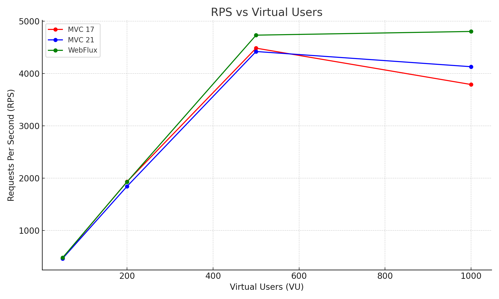
**Throughput (RPS):**
- Spring WebFlux consistently delivers the highest throughput at all concurrency levels.
- Spring MVC (Java 21) improves over MVC (Java 17) at higher load, showing ~ 9 % better RPS at 1000 VUs.
- The gap between MVC 21 and WebFlux widens as concurrency increases, suggesting the reactive model still scales best under heavy load.

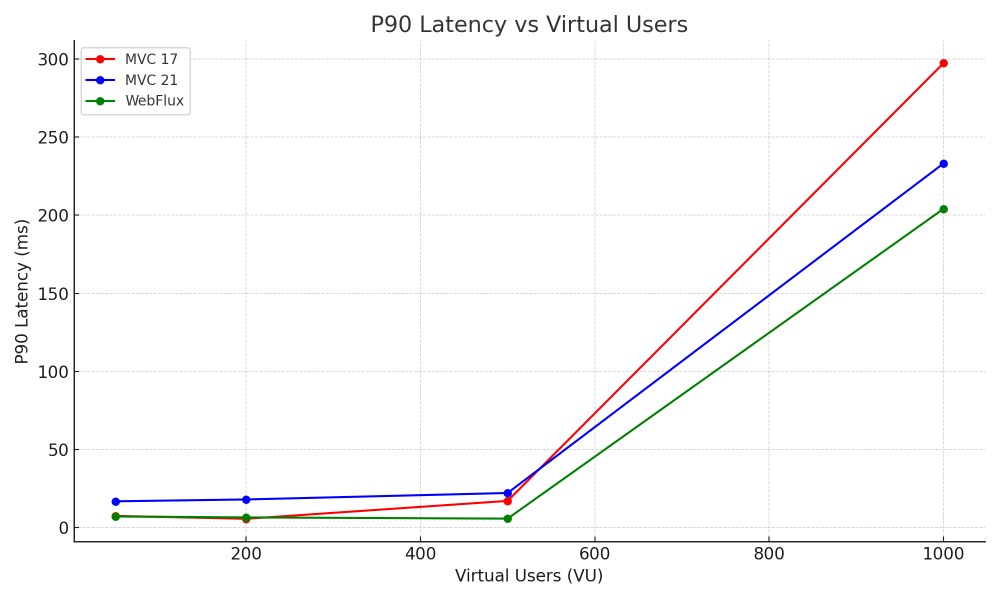
**Latency (p90):**
- At low concurrency (50–200 VUs), all three frameworks exhibit similar P90 latency (< 20 ms).
- At 500 VUs + :
  -  WebFlux holds remarkably low P90 latency (≈ 5–6 ms).
  - MVC 17/21 both rise sharply; MVC 21 improves slightly over MVC 17 but remains > 3× slower at 500 VUs.
- At 1000 VUs → MVC 17 ≈ 297 ms, MVC 21 ≈ 233 ms, WebFlux ≈ 204 ms.
  → Virtual threads mitigate some blocking overhead but still trail the non-blocking model.

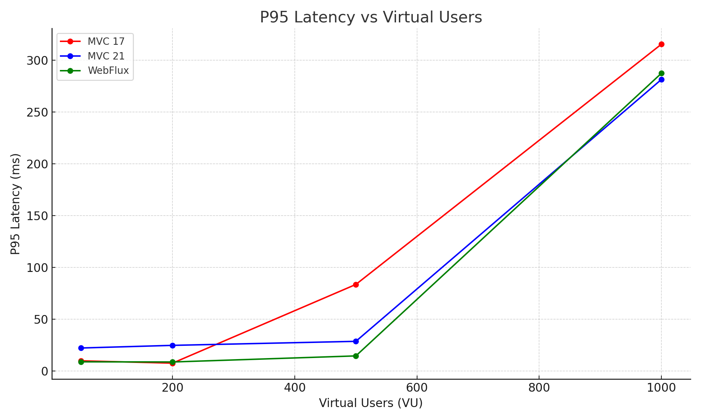
**Latency (p95):**
- Trends mirror P90 but the contrast becomes stronger:
  - WebFlux maintains P95 below 300 ms even at 1000 VUs.
  - MVC 21 reduces tail latency vs MVC 17 (281 ms vs 316 ms), showing that Java 21 virtual threads help smooth spikes.
- MVC 17’s P95 jumps to ~ 316 ms earlier, implying thread-pool saturation under blocking I/O.
## 8️⃣ Resource Metrics Over Time

These metrics are collected via **Spring Actuator → Prometheus → Grafana** and visualized during load tests.
Images display Mvc (Java 17), Mvc (Java 21), and WebFlux from top to bottom on each section
### 🔹 JVM Threads
- Observes how many threads each framework spawns under different concurrency levels.
- High thread count in Spring MVC may indicate thread saturation; WebFlux typically remains constant.
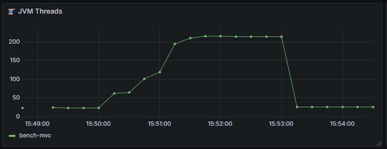
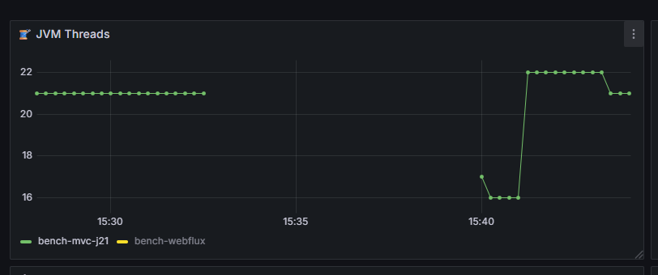
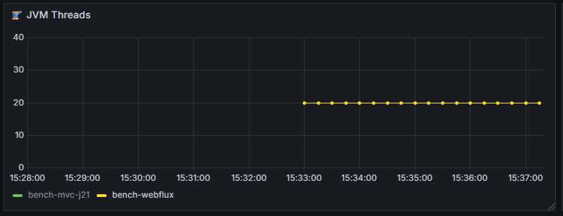

### 🔹 CPU Usage (%)
- Measures average CPU utilization during each load level.
- High values (80–100%) indicate CPU-bound workloads (serialization, mapping, etc.).
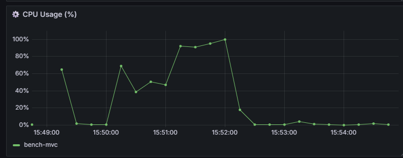
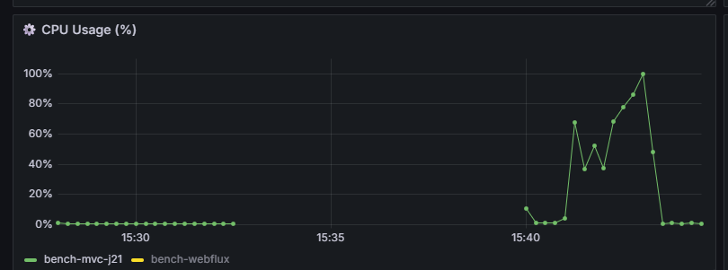
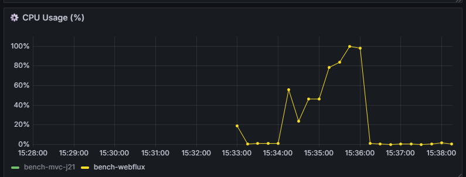

### 🔹 Memory Usage (MB)
- Shows heap consumption and GC behavior during tests.
- Useful for detecting leaks or excessive object creation.
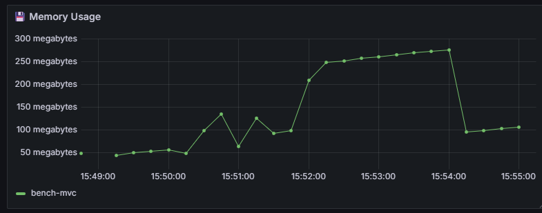
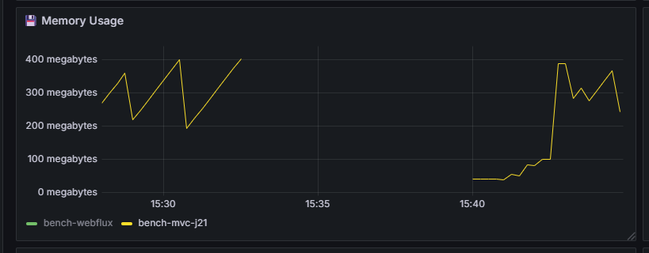
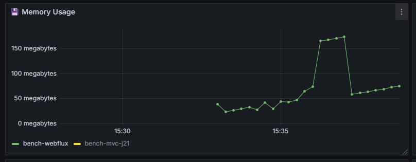

### 🔹 DB Connections
- Observes connection pool utilization.
- MVC may open more concurrent connections; WebFlux (with R2DBC) is often more efficient.
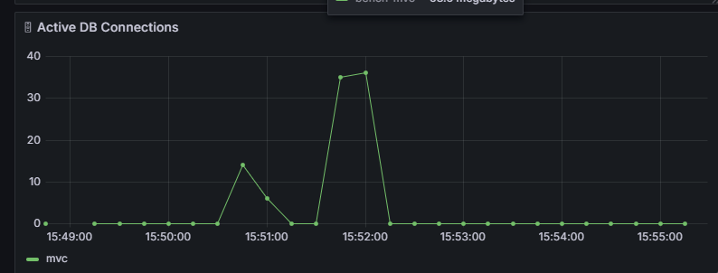
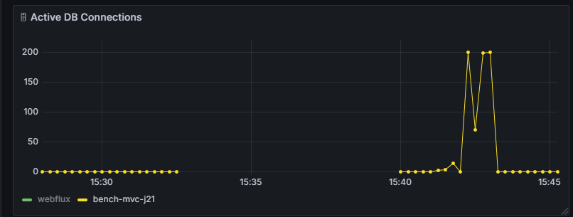
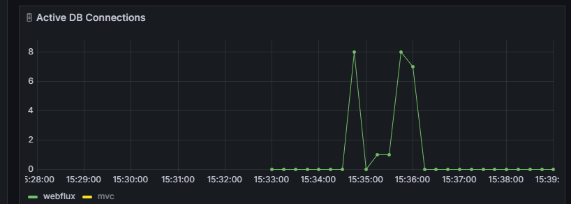
---
## 🔚 Conclusion
- ✅ **WebFlux strengths:** Handles high concurrency efficiently with fewer threads.  
- ⚙️ **MVC strengths:** Easier to implement, stable at moderate traffic levels.  
- ⚙️ **MVC Java 21 strengths:** Better performance than Java 17 version, near WebFlux at all loads.
