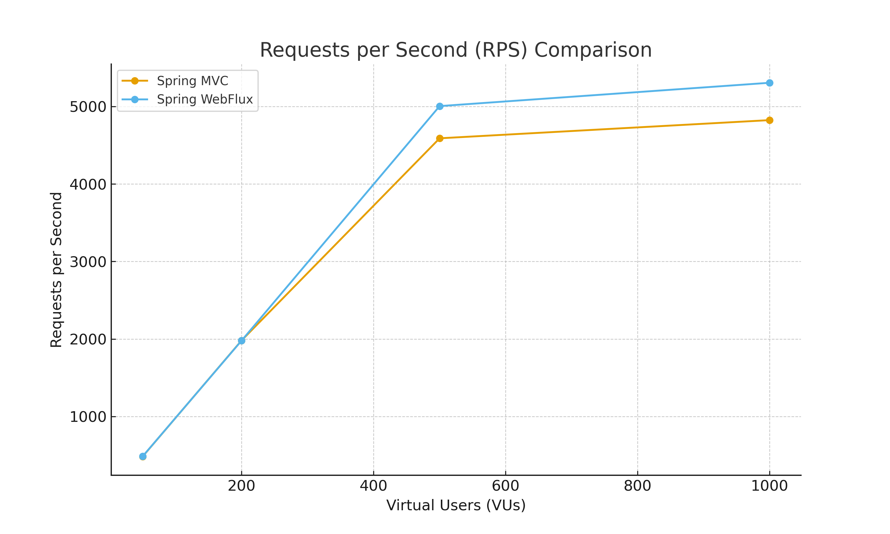
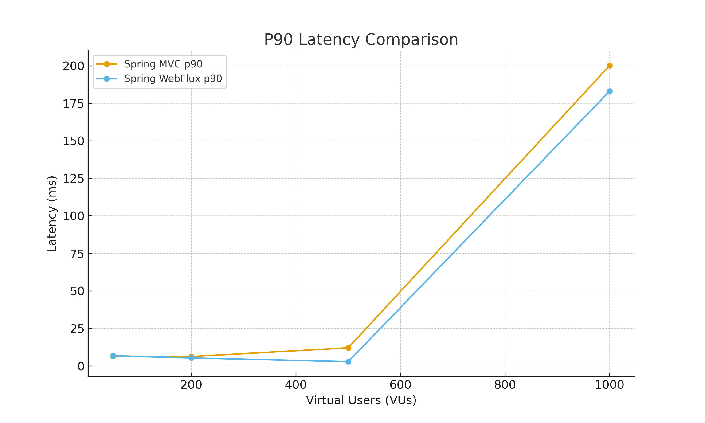
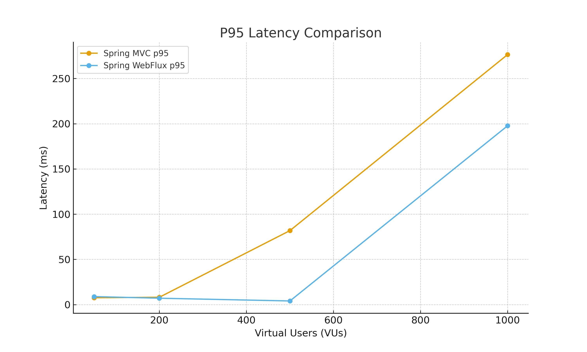
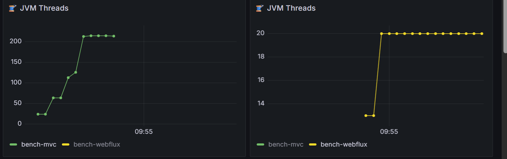
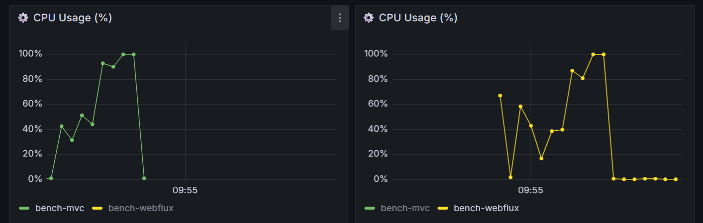
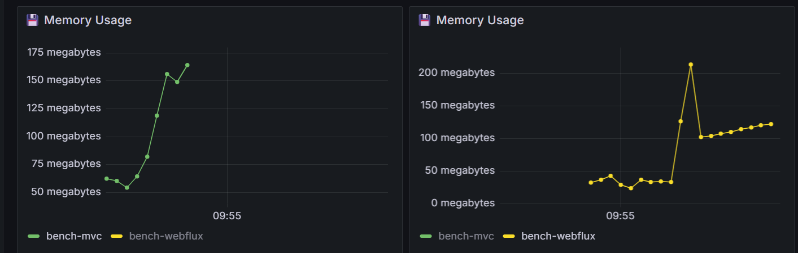
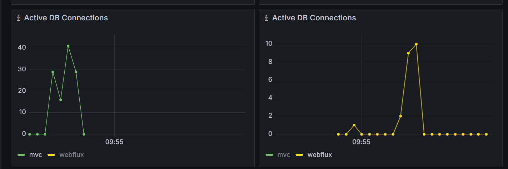

# 🧪 Spring MVC vs Spring WebFlux Benchmark Report

## 1️⃣ Overview

**Purpose:**  
This experiment evaluates and compares the performance of **Spring MVC (Tomcat)** and **Spring WebFlux (Netty)** applications under varying concurrent loads.  
The test focuses on throughput, latency, and system behavior when directly exposed (without API Gateway).

---

## 2️⃣ Application Logic

| Component | Description |
|------------|-------------|
| **Spring MVC App** | A blocking REST API built with Spring Boot + Tomcat. Exposes `/api/users/{id}` endpoint fetching user data from PostgreSQL using Spring Data JPA. |
| **Spring WebFlux App** | A reactive REST API built with Spring Boot WebFlux + Netty. Uses R2DBC for non-blocking PostgreSQL access. Exposes the same `/api/users/{id}` endpoint. |
| **Database** | PostgreSQL 15 with seeded test data (~10k user rows). Both applications connect to the same database for consistency. |

---

## 3️⃣ System Architecture

```
               ┌────────────────────────┐
               │      Load Tester       │
               │       (  k6  )         │
               └──────────┬─────────────┘
                          │
               ┌──────────▼───────────┐
               │     Application      │
               │──────────────────────│
               │  Spring MVC (Tomcat) │
               │          OR          │
               │  WebFlux (Netty)     │
               └──────────┬───────────┘
                          │
               ┌──────────▼───────────┐
               │     PostgreSQL DB    │
               │ (R2DBC or JDBC conn) │
               └──────────────────────┘
```

**Request Flow:**
1. Load tester sends concurrent GET requests to `/api/users/{id}`.  
2. The application receives and processes the request:
   - **Spring MVC:** creates a new thread per request (Tomcat worker model).  
   - **WebFlux:** processes asynchronously using event loops (Netty model).  
3. Each app queries **PostgreSQL**, maps data from Entity → DTO, and returns JSON.  
4. Prometheus collects system metrics during the run.

---

## 4️⃣ Docker Setup

| Container | Description | Resources |
|------------|--------------|------------|
| **PostgreSQL** | Holds user data | `CPU: 3 cores`, `Memory: 4GB` |
| **Spring MVC App** | Blocking Tomcat app | `CPU: 2 cores`, `Memory: 2GB` |
| **Spring WebFlux App** | Reactive Netty app | `CPU: 2 cores`, `Memory: 2GB` |
| **Prometheus + Grafana** | Metrics collection & visualization | `CPU: 1 core`, `Memory: 1GB` |

**Network:**  
All services run in the same Docker network (`bench-net`) for consistent latency and isolation.

---

## 5️⃣ Load Test Configuration

| Parameter | Value                                                                   |
|------------|-------------------------------------------------------------------------|
| **Tool** | [K6](https://k6.io)                                                     |
| **Endpoint Tested** | `/api/users/100`                                                        |
| **Virtual Users (VUs)** | 50, 200, 500, 1000                                                      |
| **Duration per Test** | 30 seconds                                                              |
| **Ramp-Up Time** | 5 seconds                                                               |
| **Data Collected** | RPS, p90 latency, p95 latency, JVM threads, CPU, memory, DB connections |

---

## 6️⃣ Metric Definitions

| Metric | Definition |
|---------|-------------|
| **RPS (Requests per Second)** | Number of HTTP requests successfully processed per second. Indicates throughput capability. |
| **p90 / p95 Latency** | 90th and 95th percentile latency — time within which 90% and 95% of requests complete. Shows tail-end performance. |
| **JVM Threads** | Active threads in the JVM (Tomcat workers or Netty event loops). |
| **CPU Usage (%)** | Average CPU utilization during the test. High usage often reflects CPU-bound operations like serialization or DTO mapping. |
| **Memory Usage (MB)** | Resident JVM memory used during the test, reflecting allocation and GC efficiency. |
| **DB Connections** | Number of active PostgreSQL connections. High counts can indicate inefficient pooling or blocking queries. |

---

## 7️⃣ Results Summary
| VUs | Framework | RPS | p90 (ms) | p95 (ms) |
|------|------------|------|-----------|-----------|
| 50 | Spring MVC | 482.04 | 6.51 | 7.59 |
| 50 | Spring WebFlux | 484.20 | 6.78 | 8.87 |
| 200 | Spring MVC | 1980.81 | 6.25 | 8.14 |
| 200 | Spring WebFlux | 1978.87 | 5.31 | 7.08 |
| 500 | Spring MVC | 4589.25 | 12.07 | 81.84 |
| 500 | Spring WebFlux | 5004.83 | 2.85 | 4.04 |
| 1000 | Spring MVC | 4823.89 | 200.08 | 276.48 |
| 1000 | Spring WebFlux | 5305.85 | 183.10 | 197.77 |
---

**Throughput (RPS):**
- RPS increases steadily from 50 to 500 VUs for both frameworks.
- WebFlux slightly surpasses MVC at all levels, reaching 5305 RPS vs 4823 RPS at 1000 VUs.
- Both scale efficiently, but WebFlux shows better peak throughput under heavy load.



**Latency (p90 / p95):**
- Up to 200 VUs, latency remains below 10 ms for both frameworks.
- At 500 VUs, MVC’s p95 latency spikes to 81.8 ms, while WebFlux stays under 5 ms.
- At 1000 VUs, both degrade, but WebFlux maintains lower latency (~197 ms) compared to MVC (~276 ms).

## 8️⃣ Resource Metrics Over Time

These metrics are collected via **Spring Actuator → Prometheus → Grafana** and visualized during load tests.

### 🔹 JVM Threads
- Observes how many threads each framework spawns under different concurrency levels.
- High thread count in Spring MVC may indicate thread saturation; WebFlux typically remains constant.


### 🔹 CPU Usage (%)
- Measures average CPU utilization during each load level.
- High values (80–100%) indicate CPU-bound workloads (serialization, mapping, etc.).


### 🔹 Memory Usage (MB)
- Shows heap consumption and GC behavior during tests.
- Useful for detecting leaks or excessive object creation.


### 🔹 DB Connections
- Observes connection pool utilization.
- MVC may open more concurrent connections; WebFlux (with R2DBC) is often more efficient.

---
## 🔚 Conclusion
- ✅ **WebFlux strengths:** Handles high concurrency efficiently with fewer threads.  
- ⚙️ **MVC strengths:** Easier to implement, stable at moderate traffic levels.  
